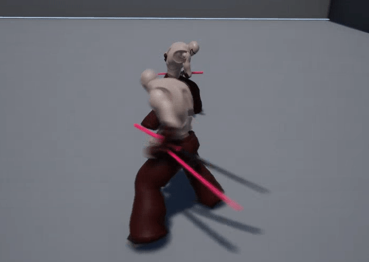

# Katana
A simple project for learning Gameplay Ability System. Everything is implemented with C++ only.
There is only a small amount of functionalities happening in this sample. This is the bare minimum of what GAS supports:

1. A **AbilitySystemComponent** is granted with a **GameplayAbility** through **GiveAbility**, which effectively returns a handle to the ability granted. 
2. A **AbilitySystemComponent** issues an ability through **TryActivateAbility** with the handle it retains.
3. **ActivateAbility** function from the **GameplayAbility** is triggered. This issues an **AbilityTask** to play montage.
4. The **AbilityTask** starts the montage and subscribes to the callback when an event with specific **GameplayTags** is sent to the **AbilitySystemComponent**.
5. An **AnimNotify** sends the above event to the **AbilitySystemComponent**, which gets propogated to the callback the **AbilityTask** provides.
6. Through the callback above, the **GameplayAbility** can then apply some **GameplayEffect** through **ApplyGameplayEffectSpecToTarget**. Simultaneously, some **GameplayCues** could be triggered through **K2_ExecuteGameplayCueWithParams**.
7. The **GameplayEffect** applied from the previous step invokes **GameplayEffectExecutionCalculation** to run the effect calculation logic.
8. Eventually, **AttributeSet** applies the actual effect using the results calculated above. This happens inside **PostGameplayEffectExecute**
  
## Base Attack
  

## Special Attack
  
